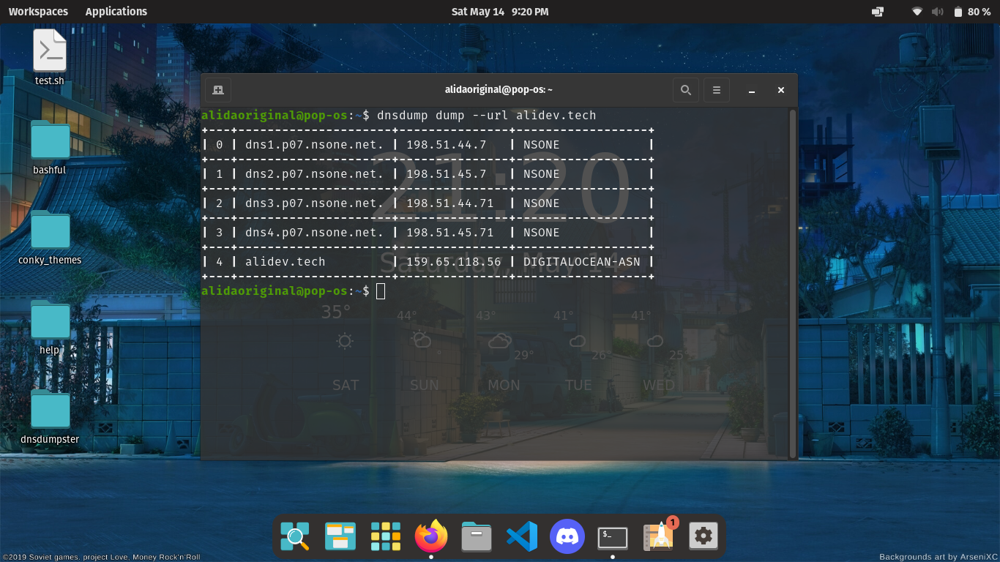

```j
██████  ███    ██ ███████ ██████  ██    ██ ███    ███ ██████  
██   ██ ████   ██ ██      ██   ██ ██    ██ ████  ████ ██   ██ 
██   ██ ██ ██  ██ ███████ ██   ██ ██    ██ ██ ████ ██ ██████  
██   ██ ██  ██ ██      ██ ██   ██ ██    ██ ██  ██  ██ ██      
██████  ██   ████ ███████ ██████   ██████  ██      ██ ██

```




A tool to dump out dns servers and Host Records.

# Installation
> 1>. Git Clone this repo
>  2>. Install cargo and Rust from the official [rust](https://www.rust-lang.org/tools/install) site
> 3>. cd into project dirctory 
> 4>.  use command **cargo install --path .** 
> 5>. Enjoy the command line dns dumper 

# Todo
- [ ] Refactor Code
- [X] Flag or commands to dump the results into a file 
- [X]  Completely scrape the site
- [ ] Publish on crates.io
